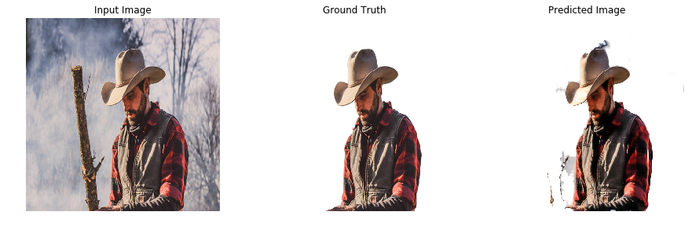

[](http://hits.dwyl.io/adriacabeza/Unnamed)
[](https://github.com/adriacabeza/Unnamed)
[](https://GitHub.com/adriacabeza/Unnamed/stargazers/)
[](https://GitHub.com/adriacabeza/Unnamed/network/)
[](https://github.com/adriacabeza/Unnamed)
[](https://www.python.org/)


# HUMAN EXTRACTOR

La finalidad del proyecto es poder **segmentar a los humanos usando una pix2pix**. El programa coge como input una imagen con una persona y es capaz de outputear la misma imagen con solo la persona. Esto además de automatizar un proceso en el que actualmente tiene que intervenir una persona, puede ayudar a gente que no tenga Photoshop (o otros) o que no sepa usarlo podrá coger sus imágenes y recortarlas con facilidad.

En lo primero que hubiera pensado para atacar este problema hubiera sido provar otras maneras y arquitecturas como **Mask RCNN** o incluso **Salency Maps** pero quería provar el approach de la pix2pix.

El framework que he escogido era Tensorflow 2.0 ya su tutorial estaba en esa versión y quería aprender acerca de su nueva versión y de su execución eager (Tensorflow sin tener que construir grafos!). Además dado que usaré Google Colab (no todo el mundo tiene GPUs increíbles en su casa), va a ser más fácil si uso Tensorflow.

Nótese que pese a que el proyecto se ha realizado principalmente en Colab también está preparado para runnearlo en local con sus diferentes ficheros y módulos, no obstante aún no lo he podido probar. 


## Resultados

Después de 200 epochs de 3035 imágenes (no hice más porque Google Colab no ha ido muy bien últimamente):

| Resultados |
|--------|
|        |
|       |
|       |
|       |
|       |
|       |
|       |
|       |
|       |
|       |
|       |


## Requisitos
- Para instalar los requisitos necesarios porfavor usa el archivo requirements.txt
```bash
pip install -r requirements.txt
```
- Sí prefieres usar Google Collab, usa este **[link](Human_extractor.ipynb)**. Recuerda que tienes que preparar el dataset previamente. 

## Arquitectura pix2pix

Este código está basado en la arquitectura **pix2pix** (por *Isola et al*). Pese a disponer de un generador y un discriminador con objetivos opuestos en busca de un equilibrio de Nash, esta arquitectura es diferente a las GANs normales pues está no coge como input ruido aleatorio (espacio latente),  en esta en cambio cogemos como input toda una imagen *x*. Nuestro objetivo es **traducirla** en otra imagen con una estructura similar. Es decir, nuestro generador *G* tiene que producir *G(X)* el cual tendrá que ser indistinguible de *y* (la otra imagen con una estructura similar) para nuestro discriminador *D*.


Sus partes principales son:

- **Generador U-NET**: el generador de la pix2pix se parece mucho a un **autoencoder**. Coge la imagen que tiene que ser traducida, la comprime a un espacio de menos dimensiones llamado **Cuello de Botella** y luego aprende a hacer upsampling para conseguir la imagen deseada como output. 

  Además también tiene ciertos parecidos con una ResNet en la manera en como la información de capas previas es introducida a las siguientes usando las llamadas **skip connections**. En esta arquitectura disponemos de skip connections que salen de la mitat encoder de la red y van a la otra mitad decoder. Esto nos sirve para prevenir que perdamos información en el cuello de botella.

<p align="center">
  
</p>

- **Discriminador Patch-GAN**: en este discriminador en vez de coger las imágenes y clasificarlas en verdaderas o falsas, se clasifican individualmente diferentes trozos de la imagen así se refuerza el objetivo de conseguir detalles mucho más nítidos. Además es más rápido de clasificar toda una imágen ya que solo tiene que clasificar pequeños trozos y eso significa menos parámetros.

<p align="center">
  
</p>


## Dataset
Se ha usado Supervisely Person como dataset. Más información [en el link](https://hackernoon.com/releasing-supervisely-person-dataset-for-teaching-machines-to-segment-humans-1f1fc1f28469). Posteriormente se ha preprocesado para que cada imagen tenga los pares de segmentado y no segmentado 

Para hacerlo podemos usar clonar el repositorio y poner nuestras imágenes normales en la carpaeta ```data/original``` y nuestras imágenes segmentadas en ```data/segmentated```. Y luego escribir:

```
python3 dataset/combine_images.py  
python3 split_dataset.py
```
Después de esto tendremos dos carpetas, ```train``` y ```test``` con la data preparada. Recuerda que si usas Colab tienes que subir las carpetas de alguna forma y poner su ruta en la variable *PATH*.

## Ejecutarlo

```bash
python3 -m model.train --dataset PATH_TO_DATASET
```

## Mejoras

El dataset es bastante pequeño así que podrían verse mejoras si se incrementase su tamaño. Además, las mejores de pix2pixHD hechos por Nvidia también se podrían aplicar para sacar mejores resultados com más definicion y *sharpness*. De hecho, mi primera opción era intentar implementarla en Tensorflow ya que la original está hecha en Pytorch, no obstante depués de leer el paper decidí que era demasiado complicada y demasiado costosa computacionalmente: 3 discriminadores diferentes con diferentes tamaños, una feature matching loss que usa los features de cada uno de los discriminadores, dos generadores diferentes que tienen que ser entrenados por separado y luego fine-tuned juntos, etc.


