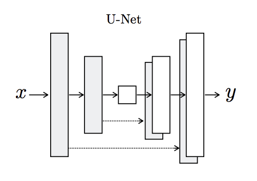

[](http://hits.dwyl.io/adriacabeza/Unnamed)
[](https://github.com/adriacabeza/Unnamed)
[](https://GitHub.com/adriacabeza/Unnamed/stargazers/)
[](https://GitHub.com/adriacabeza/Unnamed/network/)
[](https://github.com/adriacabeza/Unnamed)


# HUMAN EXTRACTOR
This tool is able to extract only the human of a picture. It is supposed to take as an input an image with a person and output the same image but just with the person cut it out. 

## Prerequisites
This project is built using the Tensorflow framework. I decided Tensorflow over another frameworks since I wanted to train on **Google Colab** (not everybody has incredible GPUs at home tho) I though that in tensorflow everything would be easier.

- To install all the requirements please use the requirements.txt

```bash
pip install -r requirements.txt
```
## Architecture
This repository is based on **pix2pix** architecture by Isola et al. In this architecture we take as input the actual image *x* that we want to **translate** into another structurally similar image *y*. Our generator *G* now has to produce *G(x)* which we want to be indistinguishable from *y* for our discriminator *D*.

Its main parts are:
- **U-NET Generator**: the generator in pix2pix resembles an auto-encoder. It takes the     image to be translated and compresses it into a low-dimensional, "Bottleneck", vector representat    ion and then the Generator then learns how to upsample it into the output image.

The U-NET generator is similar to ResNets in the way the information from earlier layers are integrated in the later layers: we have skip connections from the outputs of the encoder-hald of the network to the other decoder-half. By including this information we prevent the middle of the network to become an information bottleneck. Moreover, tose skip connections are also interesting because they do not require any resizing, projections, etc, since the spatial resolution of the layers being connected already match each other.
 <p align="center">
  
</p>

 - **PatchGAN Discriminator**: instead of taking all the image and trying to classify whether is real or fake, this discriminator classifies individual different patches of the image. This is a way to enforce more contraints that encourage sharp high-frequency details. Also it runs faster than classifying the entire image since it only classifies tiny patches it has less parameters.
 <p align="center">
  
</p>


## Dataset
The images were taken from the [OCHuman dataset](https://github.com/liruilong940607/OCHumanApi) proposed in Pose2Seg.

Firstly, we need to prepare our dataset. Each X/Y pair of images must be blended in half of the full image in the set. For this we need to put our normal images in the ```data/original```folder and our segmentated images in the ```data/segmentated```. Then type:

```
python3 dataset/combine_images.py  
python3 split_dataset.py
```

After that we will have two folders ```train```and ```test```with the prepared data to train.

## Run

```bash
python3 -m src.train --dataset PATH_TO_DATASET
```

## Improvements

The dataset was really small (about X images) so a good improvement could be to increase the dataset to see if the model improves its performance. Also, pix2pixHD improvements by Nvidia could be applied in order to output sharper and more define images. 
