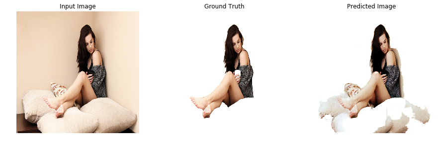
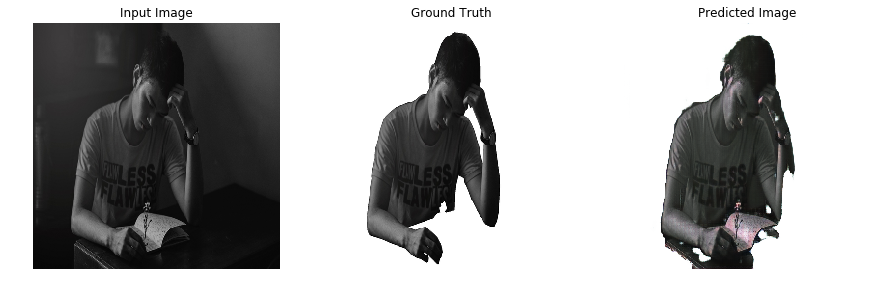

[](http://hits.dwyl.io/adriacabeza/Human-Extractor)
[](https://github.com/adriacabeza/Human-Extractor)
[](https://GitHub.com/adriacabeza/Human-Extractor/stargazers/)
[](https://github.com/adriacabeza/Human-Extractor)
[](https://www.python.org/)
[](https://colab.research.google.com/github/adriacabeza/Human-Extractor/)


# HUMAN EXTRACTOR

**This tool is able to extract only the human of a picture using a pix2pix architecture**. It is supposed to take as an input an image with a person and output the same image but just with the person cut it out. 

This project is built using the Tensorflow framework, more precisely, it is done using Tensorflow 2.0 and its eager execution. Why? Well, I was kinda curious about it (Tensorflow without building graphs!) and I took this project as an excuse to learn about it. Moreover, I decided Tensorflow over another frameworks since I wanted to train on **Google Colab** (not everybody has incredible GPUs at home tho) and I though that in tensorflow everything would be easier. 

To tackle this problem the first ways that would come to mind would be a Mask RCNN or even Salency Maps but I wanted to try the approach using a pix2pix. 

Notice please that even though the project was mainly done using **Google Colab** and a notebook there is a project too with its separate files and modules. However it has not been proved.


## Result

After 200 epochs of 3035 images this are some of the results: 

| Results |
|--------|
|      |
|       |
|       |
|       |
|       |
|       |
|       |
|       |
|       |
|       |
|       |

Also here you have the **[saved_model, the .h5](./generator_3saved_model)** and the [**tensorflowjs** model converted](./output)

## Prerequisites
- To install all the requirements please use the requirements.txt
```bash
pip install -r requirements.txt
```
- If you want to use Google Collab, use this **[Jupyter Notebook](Human_extractor.ipynb)**. Remember that you will need to prepare the dataset.

## Architecture
This repository is based on **pix2pix** architecture by Isola et al. In this architecture we take as input the actual image *x* that we want to **translate** into another structurally similar image *y*. Our generator *G* now has to produce *G(x)* which we want to be indistinguishable from *y* for our discriminator *D*.

Its main parts are:
- **U-NET Generator**: the generator in pix2pix resembles an auto-encoder. It takes the image to be translated and compresses it into a low-dimensional, "Bottleneck", vector representation and then the Generator then learns how to upsample it into the output image.

The U-NET generator is similar to ResNets in the way the information from earlier layers are integrated in the later layers: we have skip connections from the outputs of the encoder-half of the network to the other decoder-half. By including this information we prevent the middle of the network to become an information bottleneck. Moreover, those skip connections are also interesting because they do not require any resizing, projections, etc, since the spatial resolution of the layers being connected already match each other.
 <p align="center">
  
</p>

 - **PatchGAN Discriminator**: instead of taking all the image and trying to classify whether is real or fake, this discriminator classifies individual different patches of the image. This is a way to enforce more contraints that encourage sharp high-frequency details. Also it runs faster than classifying the entire image since it only classifies tiny patches it has less parameters.
 <p align="center">
  
</p>


## Dataset
The images were taken from the [Supervisely Person dataset](https://hackernoon.com/releasing-supervisely-person-dataset-for-teaching-machines-to-segment-humans-1f1fc1f28469).

Firstly, we need to prepare our dataset. Each X/Y pair of images must be blended in half of the full image in the set. For this we need to put our normal images in the ```data/original```folder and our segmentated images in the ```data/segmentated```. Then type:

```
python3 dataset/combine_images.py  
python3 split_dataset.py
```

After that we will have two folders ```train```and ```test```with the prepared data to train. Remember that if you are using **Google Colab** you should upload those folders in a folder called ```prepared```.

Also, after running the model you will have a white-backgrounded image, if you need it with transparency please use [this script](./dataset/delete_white.py).

```bash
python3 delete_white.py --image image.jpg
```

## Run

```bash
python3 -m model.train --dataset PATH_TO_DATASET
```

## Improvements

The dataset was kinda small (less than 5k images) so a good improvement could be to increase the dataset to see if the model improves its performance. Also, pix2pixHD improvements by Nvidia could be applied in order to output sharper and more define images. Actually, my first choice was to try to implement it in Tensorflow since the only implementation I have found is the original one in Pytorch, but after reading the paper I decided that it was too difficult for a person who does not even have a proper GPU: 3 different discriminators with different scales, feature matching loss using features from each discriminator and two different generators, the local enhancer and the global network who must be trained separately and then fine-tuned together.

## Demo 
I wanted to learn about **tensorflowjs** too so I created a simple website to insert the model and make it simple for you to try it. Click the [link](https://adriacabeza.github.io/Human-Extractor/) to try it out.


<p align="center">

</p>

- [README en español](README-es.md)
